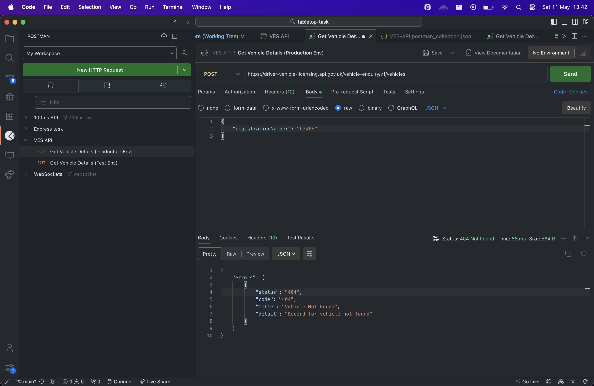

# Tabletop Task

## Overview

This is a project integrating with DVLA API to show information about stored cars.
The link is https://tabletop-task.vercel.app/.
Some VRNS you can test it with:

- AA19DSL
- AA19MOT
- AA19AMP
- AA19 (Not in mock data)
- WN67DSO (Not in mock data)

## Installation 📦

1. **Clone the repository**:

```bash
git clone <repository-url>
```

2. **Install dependencies**:

```bash
npm install
```

3. **Configure your env file**:

```env
API_URL=
API_KEY=
```

4. **Run the development server**:

```bash
npm run dev
```

**then in another terminal instance:**

```bash
npm run start
```

## Points 🌟

- I spun up a proxy server using Express. I didn't want to call a protected endpoint from the front end.
- Also to avoid CORS errors.
- I realised a bunch of VRN codes in the API example weren't working 🫤
  - AA19PPP
  - L2WPS
  - AA19SRN
  - AA19EEE
    
- I made a mock data file by copying the VRN data from [here](https://developer-portal.driver-vehicle-licensing.api.gov.uk/apis/vehicle-enquiry-service/mock-responses.html#ves-api-test-environment).
- It first checks the original API, then if it fails, falls back on the mock one.
- I then modified the index.html & style.css a bit for styling.
- The input bar is accessible 😌
- Fixed the bugs in Garage.js. Added two helpful functions.
- I decided to host on Vercel. Had issues uploading the express server so I just made a vertical function 'vehicles' that does the same thing.
- I updated the src on which endpoint to point to during prod vs dev mode.
- 👍🏾 Pretty interesting project using vanilla JS. It made me appreciate the easy-to-use abstractions provided by frameworks like React & Nextjs.
